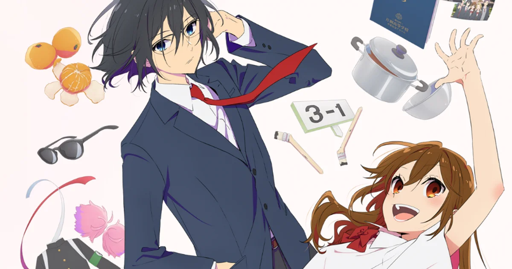

  

    

## 👻 BESTO PROTECO COURSE 👻

  

De todos los cursos de PROTECO, mis favoritos fueron:
- Linux
- Redes de Datos
- Desarrollo Web
- Java
- Python

Me gustaron mucho por el hecho de que aprendí y apliqué conceptos que antes nunca había visto y que creo son muy útiles, independientemente de que el curso haya sido divertido C:

## 🎆 ¿Cuál fue su experiencia agradable dentro del programa y la que no? 🎆

La experiencia más agradable que me llevo de ser prebe es la gente tan cul que conocí. Definitivamente admiro a todos los becarios y prebes, porque creo que con estar aquí tienen un compromiso y actitud que hace mucho no veía, de igual manera son personas agradables y que sin duda estoy feliz de haber conocido :D

También me gustó el empeño que pusieron los becarios para hacer que los cursos sean lo mejor posible, de verdad que se agradece mucho.

En cuanto a experiencias desagradables, puedo decir que no dormir por terminar algún que otro cuestionario, o que de repente por la noche aparezca una asignación con un cuestionario para el día siguiente, son cosas que no me agradaron. También recuerdo la frustración al hacer proyectos que si bien tuvimos suficiente tiempo para hacerlos, esa frustración de que no quede de la manera que había planeado era desalentadora.

Aunque hubieron experiencias desagradables, yo considero que son opacadas por lo bueno que me dejó el programa. Realmente considero que todo es por el bien de la trama.

## 🎏 5 Libros, canciones, animes, series, hobbies o todo junto. 🎏

### Libros 📚

Realmente no leo mucho, soy más de videojuegos. Sin embargo, si he leído un par de lecturas que me dejaron marcado. Mis recomendaciones:

  

####  **Indigno de ser humano**. Osamu Dazai

"Indigno de ser humano" (también conocido como "No Longer Human") es una novela escrita por Osamu Dazai, uno de los autores más destacados de la literatura japonesa del siglo XX. Publicada por primera vez en 1948, la historia está basada en gran parte en las experiencias personales del autor.

El libro narra la vida de Yozo Oba, un joven atormentado y alienado que lucha por encontrar su lugar en la sociedad. Yozo se enfrenta a una profunda sensación de desapego y vacío emocional, lo que le lleva a adoptar una máscara de aparente felicidad y despreocupación en su interacción con los demás.

Es un libro que personalmente me encanta, porque lo leí en momentos donde empaticé con el protagonista, y el cual, me hizo ver las cosas de manera diferente. 

 
 
 
 

  

#### **El nombre del viento**. Patrick Rothfus.

"El nombre del viento" es la primera entrega de la trilogía "Crónica del asesino de reyes", escrita por Patrick Rothfuss. Publicada en 2007, la novela sigue la vida y las aventuras de Kvothe, un joven prodigio y músico en un mundo de fantasía.

La historia comienza cuando Kvothe, conocido por sus habilidades musicales y su mente aguda, decide contar su vida a Chronicler, un historiador interesado en los secretos y hazañas del protagonista. A medida que Kvothe relata su pasado, el lector es llevado a un viaje por un mundo lleno de magia, misterio y peligro.

En mi opinión el mejor libro sobre fantasía. Patrick Rothfus hace un gran trabajo describiendo las situaciones, lugares, de una manera tan única que hace del libro una lectura ligera y con ganas de mas. Sigo en la espera del tercer libro :C

### Canciones 🎹

Las siguientes canciones son canciones con las que recientemente he tenido una pequeña obsesión porque son buenísimas! :D

  

#### Tsuki wo miteita - Kenshi Yonezu

Canción escrita por Kenshi Yonezu como tema principal del nuevo juego de Final Fantasy XVI

Para mi todo lo que hace Kenshi Yonezu es muy bueno, y esta canción no es la excepción.

  

 
 

  

#### Tsuki no wan - sakanaction

  

 
 

  

#### Kinen Satsuei - BUMP OF CHICKEN 

  

 
 

### Animes 🔮

Los siguientes animes son con los que recientemente he estado más obsesionado/emocionado. Es difícil hacer un ranking de los animes más culs para mi, pero definitivamente puedo recomendar estos animes de los cuales he estado viendo y puedo decir que son buenardos! :D

#### Hell's Paradise

  

#### Horimiya

  

#### Dr. Stone

  

### Series 📺

#### How I met your mother

Es mi serie favorita. La he visto muchas veces, y no me canso de verla, me encanta su humor y todo. Aunque el final no sea de lo mejor..

  

 
 

### Hobbies 🎙️

En cuanto a mis hobbies, tengo varios aunque haya unos que no puedo soltar.

#### Violín
Me gusta mucho tocar el violín. Antes quería ser violinista, pero por azares del destino aquí estoy XD

#### Guitarra
Me encanta tocar guitarra y cantar. Este semestre no pude hacer nada por la carga de trabajo, pero me encanta y hasta se me vuelve obsersión. Tocar canciones de Vaundy es lo mejor. 

#### Producción musical
Honestamente, creo que debí haber estudiado música, pero ekis. Me encanta la producción musical, covers, y todo lo relacionado :D

#### Videojuegos
Amo los videojuegos. Tengo muchísimos en la lista de espera, pero estas vacaciones de verano, me estoy pasando el Mario & Luigi Superstar saga en la nintendo switch! :D. También he estado jugando Darkest Dungeon, y demás... hay muuuuchos juegos que necesito terminar XD
De igual forma, todos los días ahora si, juego valorant, un juego de disparos en primera persona. C:

#### Ilustación
Me encanta la ilustación, ya sea digital o 'tradicional', prácticamente uso instagram y twitter para ver ilustraciones de ilustradores de todo el mundo.
También  me gusta mucho dibujar, pero el tiempo no me deja :C, entre tantas cosas por hacer, no puedo practicar diario el dibujo.

#### Encuadernación.
Me gusta la encuadernación, y prácticamente coleccionar cuadernos bonitos. Yo hice mi sketchbook y de hecho me gusta hacer cuadernos para regalar :D, cuando tenga dinero me pagaré algún curso.

#### Idiomas
Me gusta estudiar idiomas. Actualmente estoy estudiando japonés formalmente, y antes lo hacía con el Ruso, pero ya no pude desde que regresamos de pandemia. De igual manera, terminé mis cursos de inglés, el cual actualmente cuento con un nivel B2-C1 C:

#### Stalkear 🤨
🤨 🤨 🤨 🤨 🤨 🤨 🤨 🤨 🤨 🤨 🤨 🤨 🤨 🤨 🤨 🤨 🤨 🤨 🤨 🤨 🤨 🤨 🤨 🤨 🤨 🤨 🤨 🤨 

#### Pines
Últimamente he estado obsesionado con tener pines bonitos. Vivan los pines. Lo malo es que son caros :C
